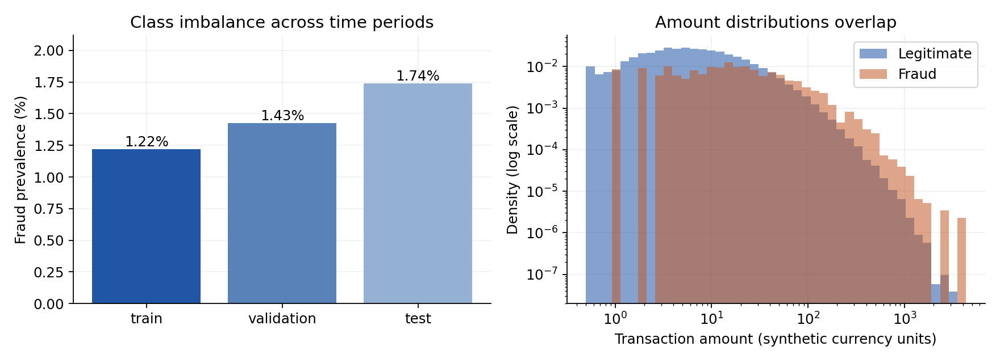
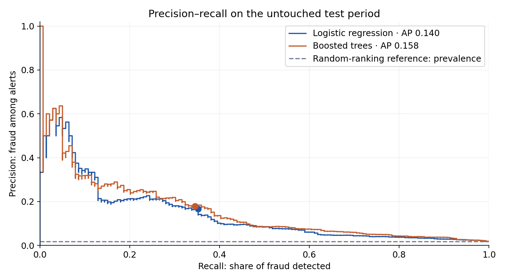
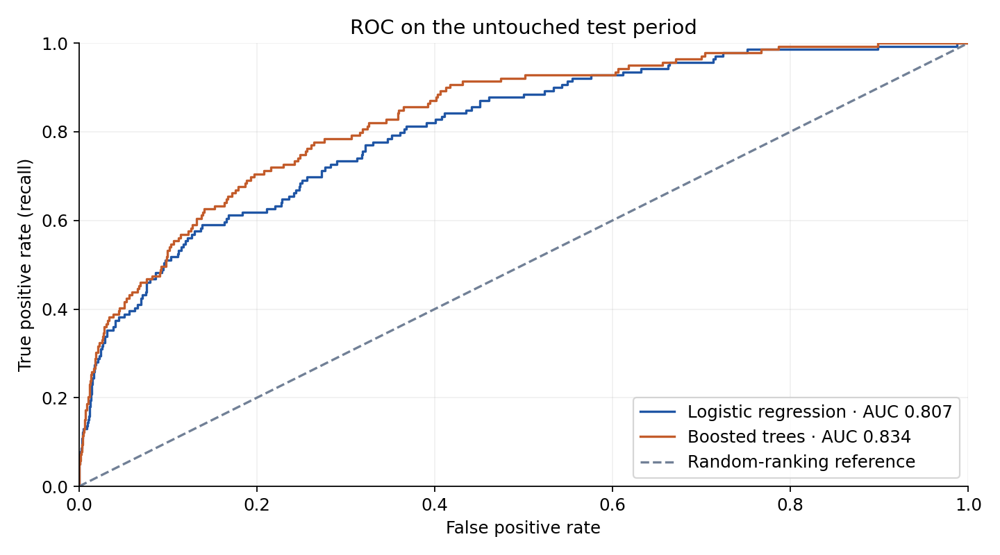
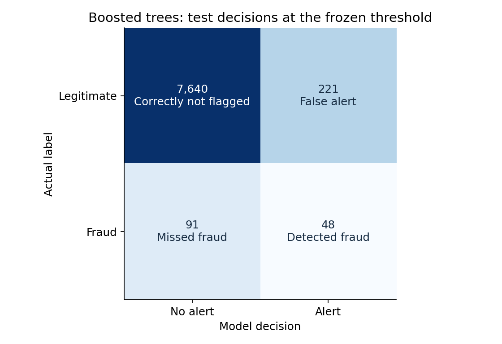
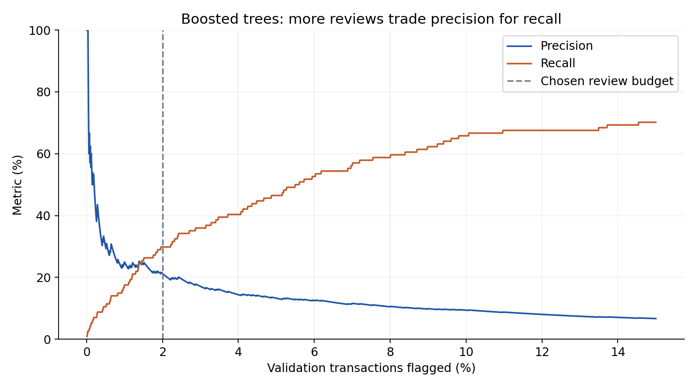
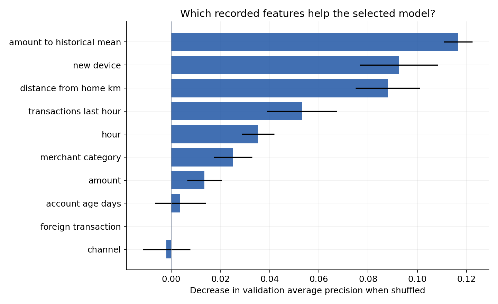

# Fraud detection: experiment report

**Simulated data · Educational experiment · No real-world performance claim**

## Results

The validation-selected boosted trees flags 269 of 8,000 test transactions. It detects 48 of 139 fraud cases (34.5% recall), and 17.8% of its alerts are fraud. There are 221 false alerts and 91 missed fraud cases.

Selected by validation average precision: **Boosted trees**.

| Model | Validation AP | Test AP | Test ROC AUC | Test precision | Test recall | Test alerts |
|---|---:|---:|---:|---:|---:|---:|
| Logistic regression | 0.162 | 0.140 | 0.807 | 16.6% | 35.3% | 3.7% |
| Boosted trees | 0.179 | 0.158 | 0.834 | 17.8% | 34.5% | 3.4% |

Always-legitimate baseline: 98.3% accuracy, zero recall. Random-ranking AP reference: 0.017.

## Workflow

1. Generate transactions with the fixed seed and persist a dataset fingerprint.
2. Split in chronological order: 60% train, 20% validation, 20% test. IDs and timestamps are not predictors.
3. Fit numeric scaling, categorical encoding, logistic regression and boosted trees on training data only.
4. Select the model using validation AP and thresholds under a 2.0% validation review budget.
5. Freeze decisions and evaluate later transactions. Selected threshold: 0.078650.

The generator samples fraud from amount, device, foreign status, time, category, velocity and interactions plus hidden noise and mild time drift. Historical account means are idealized pre-period profiles. Prior-hour counts use only earlier transactions. Labels are never predictors.

## Figures

Fraud is rare in every period. Amounts overlap, so a large transaction alone cannot establish fraud. Amount histograms are normalized separately within each class.

Dots show thresholds fixed using validation data. Average precision (AP) summarizes precision across recall levels; it is not accuracy and is not trapezoidal PR area.

ROC measures ranking across thresholds. With rare fraud, a low false-positive rate can still produce many false alerts; read it alongside precision–recall.

Cell labels are exact transaction counts; background colors use a log scale to keep small cells visible. Alerts mean review candidates, not proven fraud.

This curve uses validation data only. The threshold fills the budget as closely as score ties allow; the test alert rate may exceed or fall below that budget.

Validation permutation importance: five shuffles per feature; error bars show standard deviation across shuffles. Associations reflect the simulation and model, not causal explanations.

## Test uncertainty

| Metric | Estimate | 95% bootstrap interval |
|---|---:|---:|
| average precision | 0.158 | 0.111–0.222 |
| precision | 0.178 | 0.129–0.229 |
| recall | 0.345 | 0.273–0.421 |

200 fixed-model transaction-level bootstrap samples. Intervals exclude retraining and model-selection uncertainty and do not account for repeated accounts or temporal dependence.

## Conclusions

The model concentrates probable fraud into a small review queue: test average precision is 0.158, compared with a random-ranking reference of 0.017. At the chosen workload, most fraud is still missed, showing why threshold selection is a business decision. This result demonstrates how the workflow works on this simulator; it does not establish effectiveness on real transactions.

The threshold was selected under a 2.0% validation review budget, but flagged 3.4% of test transactions. The budget is a validation constraint, not a guarantee on future workload; a real review team would need volume monitoring and an overflow policy.

Scores are not calibrated real-world fraud probabilities. Review costs are unspecified; the review budget is illustrative. Accounts may repeat across periods, so unseen-account generalization is untested. Real deployment needs mature labels, causal features, rolling validation, calibration and cost analysis.

## Reproducibility

See [README](../README.md) for exact commands and the self-contained [HTML report](report.html) for the full explanation.

Configuration: `{'rows': 40000, 'seed': 42, 'review_budget': 0.02}`

Dataset SHA-256: `5c97ace453abb6b58a8b6567a8d07efc0f8687034f03d64913869cba8c731297`
